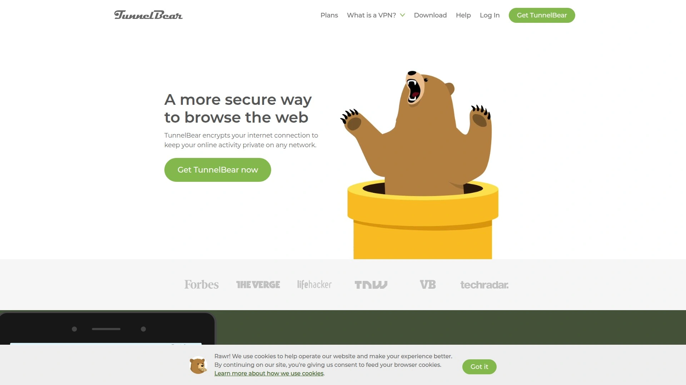

# No More Privacy Worries! Recommend 12 Security-First Game-Changers

Browsing the internet without protection is like leaving your front door wide open in a sketchy neighborhood. Your ISP tracks every site you visit, advertisers follow your movements, and hackers target unsecured connections. A solid VPN service encrypts your traffic, masks your location, and lets you stream content from anywhere without constant surveillance. These platforms deliver real security without slowing you down to a crawl.

## **[OVPN](https://www.ovpn.com)**

Court-proven no-logging policy with bare-metal security.

OVPN emerged victorious from a two-month information injunction when Swedish authorities requested user data, proving their zero-logging policy isn't just marketing talk. The company owns all hardware infrastructure and runs every VPN server without hard drives—everything operates in RAM only, meaning your data physically cannot be stored even if someone seized their equipment. This bare-metal approach eliminates the risks of rented servers and virtual machines that other providers rely on.

Founded in Sweden, OVPN Integritet AB takes privacy so seriously they put it in their company name. Monthly transparency reports published since 2014 detail server statistics and information requests, maintaining complete openness about their operations. The level-two technical support team actually understands networking, so you won't waste time explaining basic concepts to undertrained reps. They support both OpenVPN and WireGuard protocols with military-grade encryption, and their DNS servers prevent leaks that expose your browsing habits. While they don't operate servers in 150 countries, their selective approach prioritizes security and performance over vanity metrics. Port forwarding up to seven ports works seamlessly, and add-ons like Multihop routing and Public IPv4 addresses provide extra flexibility for advanced users.

## **[ExpressVPN](https://www.expressvpn.com)**

Premium speed leader with extensive global coverage.

ExpressVPN maintains servers in 94 countries, providing the widest geographic coverage available. Their network delivers consistent high-speed connections that rarely drop below 90% of your baseline internet speed, making them ideal for bandwidth-heavy activities like 4K streaming and large file transfers. The service allows eight simultaneous connections per account, covering most household needs without requiring separate subscriptions.

The Keys password manager integrates directly into longer subscription plans, adding value beyond basic VPN functionality. Identity protection features on premium plans include theft insurance, credit monitoring, and data removal services that actively scrub your information from data broker databases. Split-tunneling lets you route specific apps through the VPN while others use your regular connection, optimizing both security and performance. Their 256-bit AES encryption with DNS leak protection ensures nothing slips through, while kill switches automatically disconnect your internet if the VPN drops. The 30-day money-back guarantee provides risk-free testing, though their monthly cost sits on the higher end at $13.

## **[NordVPN](https://www.nordvpn.com)**

Fastest measured speeds with double VPN encryption.

NordVPN crushed speed tests with only 3% average speed loss, outperforming every major competitor by significant margins. Their 5,200+ servers across 61 countries provide reliable connections without congestion, even during peak usage hours. The service supports up to ten simultaneous devices, making it practical for families or individuals with multiple gadgets requiring protection.

Double VPN encryption routes traffic through two separate servers, creating virtually unbreakable encryption for sensitive activities. The CyberSec feature blocks ads and malware at the network level before they reach your device, eliminating annoying popups and dangerous threats automatically. Obfuscated servers disguise VPN traffic as regular HTTPS connections, allowing you to bypass restrictions in countries that actively block VPN usage. Their SmartPlay technology seamlessly unblocks streaming services including Netflix, Disney+, and Prime Video across multiple regional libraries. Monthly plans cost $11.99, but longer commitments drop to $2.99 per month for two-year subscriptions, delivering premium features at budget-friendly rates.

## **[Surfshark](https://surfshark.com)**

Unlimited simultaneous connections with aggressive pricing.

Surfshark removes device limits entirely, letting you protect every phone, computer, tablet, and smart TV in your household with a single subscription. This unlimited approach makes it perfect for large families or tech enthusiasts with extensive device collections. The service operates over 3,200 servers in 100 countries since launching in 2018, expanding rapidly to match established competitors.

Built-in antivirus protection guards against malicious software beyond just VPN security, creating comprehensive digital defense. CleanWeb blocks ads, trackers, and phishing attempts before they load, speeding up browsing while protecting your privacy. The Bypasser feature provides advanced split-tunneling that works on all platforms, giving precise control over which apps use the VPN. Two-factor authentication secures your account, and they accept cryptocurrency payments for completely anonymous subscriptions. Plans start at $2.49 monthly for 24-month commitments, making Surfshark one of the most affordable premium VPN options available.

## **[PureVPN](https://www.purevpn.com)**

Decade-plus reputation with extensive server network.

Since 2006, PureVPN has built a constellation of over 6,500 servers across 70+ countries, providing robust global coverage. The service uses proprietary technology developed specifically for handling changing broadband connections smoothly, maintaining stable VPN tunnels even when switching between WiFi and cellular data. All servers support multiple security protocols, letting you choose between speed and maximum encryption based on your needs.

Port forwarding capabilities work reliably for torrenting, gaming servers, and remote access scenarios requiring incoming connections. Their split-tunneling implementation allows granular control over which traffic uses the VPN, optimizing bandwidth for streaming while protecting sensitive activities. The service includes dedicated IP options for users needing consistent addresses that won't trigger fraud detection systems. Browser extensions for Chrome and Firefox provide lightweight protection without installing full desktop clients. Ten simultaneous connections cover extensive device needs, and their 31-day money-back guarantee exceeds the industry standard trial period.

## **[IPVanish](https://www.ipvanish.com)**

Self-owned server infrastructure with unlimited devices.

IPVanish owns and operates its entire server network rather than renting from third parties, maintaining complete control over security and performance. This ownership model eliminates concerns about unknown entities accessing your encrypted data, similar to OVPN's approach. The service imposes no device limits, protecting unlimited simultaneous connections under a single account.

SOCKS5 proxy support provides an alternative to full VPN connections for applications requiring faster speeds with lighter encryption. Their split-tunneling works across all major platforms including mobile devices, giving flexibility most competitors lack. Automatic connection on untrusted networks protects you when joining public WiFi at coffee shops or airports without manual intervention. WireGuard protocol support delivers the fastest possible speeds with modern encryption standards. Plans include cloud storage backup services, adding practical value beyond VPN functionality for comprehensive digital protection.

## **[Private Internet Access](https://www.privateinternetaccess.com)**

Open-source transparency with advanced customization.

Private Internet Access publishes their VPN client source code openly, allowing independent security researchers to audit every line for vulnerabilities or backdoors. This transparency builds trust through verification rather than blind faith in corporate promises. The service operates over 30,000 servers globally, providing the largest network infrastructure available for optimal connection routing.

Advanced users appreciate the extensive customization options including encryption level selection, port configuration, and protocol choices that most VPNs oversimplify. The MACE feature blocks ads, trackers, and malware at the DNS level before content loads, cleaning up your browsing experience automatically. Port forwarding works reliably for peer-to-peer applications, though setup requires technical knowledge compared to simpler competitors. Split-tunneling across all platforms gives precise control over which applications use VPN protection. Unlimited device connections protect everything without worrying about connection counts or device priorities.

## **[CyberGhost](https://www.cyberghostvpn.com)**

Streaming-optimized servers with 45-day guarantee.

CyberGhost operates 15,000+ servers across 120+ countries, providing the most extensive physical network available. Their specialized streaming servers optimize specifically for Netflix, Disney+, Hulu, BBC iPlayer, and dozens of other platforms, eliminating the trial-and-error of finding working servers. SmartDNS support enables VPN functionality on devices that don't support traditional VPN clients like smart TVs and gaming consoles.

Seven simultaneous connections cover most household needs without device juggling. The 45-day money-back guarantee for longer plans provides the longest risk-free trial period in the industry, giving you plenty of time to test thoroughly. Their NoSpy servers in Romania operate under the company's direct supervision at their headquarters, adding extra security for privacy-focused users. Automatic WiFi protection activates the VPN whenever you join unfamiliar networks, preventing exposure on public connections. Monthly plans cost $11.99, but annual commitments drop significantly to around $3 monthly.

## **[Proton VPN](https://protonvpn.com)**

Swiss privacy with Secure Core architecture.

Proton VPN comes from the team behind ProtonMail, bringing their encrypted email expertise to VPN services. Based in Switzerland with its strong privacy laws, the company operates outside intelligence-sharing alliances that compromise other providers. Their Secure Core network routes traffic through privacy-friendly countries before reaching final destinations, protecting against advanced network surveillance even if exit servers are compromised.

The proprietary Stealth protocol bypasses VPN blocking in restrictive countries where standard protocols get detected and blocked. Free tier availability with unlimited bandwidth lets you test without payment information, though speeds are limited compared to paid plans. NetShield blocks ads, trackers, and malware at the network level across all your devices. Perfect Forward Secrecy changes encryption keys for every session, preventing decryption of past traffic even if future keys are compromised. Plans support up to ten devices simultaneously, and their strict no-logs policy undergoes regular independent audits.

## **[TunnelBear](https://tunnelbear.com)**

User-friendly interface with independent audits.

TunnelBear became the first VPN to conduct regular independent security audits, setting the transparency standard other providers now follow. Owned by McAfee since 2018, the service benefits from the security giant's resources while maintaining its playful, accessible interface. The free tier provides 500MB monthly, letting you test functionality before committing to paid plans.

Three thousand servers across 47 countries provide solid coverage without overwhelming complexity. Their GhostBear mode obfuscates VPN traffic to bypass blocks in restrictive networks. The VigilantBear kill switch cuts internet access immediately if the VPN connection drops, preventing accidental data exposure. Browser extensions for Chrome, Firefox, and Edge provide lightweight protection without full desktop clients. Plans start at $4.99 monthly for annual subscriptions, positioning TunnelBear as an affordable entry point for VPN newcomers who prioritize ease of use.

## **[Windscribe](https://windscribe.com)**

Generous free tier with flexible pricing.

Windscribe offers 10GB monthly free data, making it the most generous no-cost VPN available for casual users. Their custom "Build a Plan" option lets you pay $1 per location, creating customized subscriptions that match your specific needs rather than forcing all-or-nothing packages. This flexibility works perfectly if you only need servers in specific countries.

R.O.B.E.R.T. is their custom DNS-level blocking tool that filters ads, trackers, malware, and social media widgets before they load. Split-tunneling works seamlessly across desktop and mobile platforms. Unlimited simultaneous connections protect all your devices without restrictions. Their browser extensions block WebRTC leaks and provide location spoofing beyond just IP address changes. Proxy gateway support adds another layer of routing options for advanced users. Annual unlimited plans cost $4.08 monthly, delivering comprehensive features at budget pricing.

## **[Ivacy VPN](https://www.ivacyvpn.com)**

Budget-friendly with split-tunneling pioneer heritage.

Ivacy VPN pioneered split-tunneling features back in 2010, establishing them as early innovators before the feature became standard. Their 6,500+ servers across 100+ locations provide extensive coverage at remarkably low prices. Five-year plans drop costs below $1 monthly, making Ivacy one of the cheapest premium VPNs available for long-term commitments.

Purpose-built streaming mode automatically connects to optimal servers for unblocking Netflix, Hulu, Disney+, and other platforms. Dedicated IP addresses are available for users needing consistent addressing for work or personal projects. The service allows ten simultaneous connections, covering extensive device collections. P2P file sharing works unrestricted on designated servers optimized for torrenting. 256-bit encryption with multiple protocol options balances security and speed based on your priorities. Their 30-day money-back guarantee lets you test thoroughly before fully committing.

### FAQ Common Questions

**Can VPN services actually protect me from government surveillance?**
Quality VPNs with proven no-logging policies and RAM-only servers make mass surveillance impractical, though targeted attacks by well-resourced agencies may still succeed. Choose providers with court-proven track records and transparency reports for best protection.

**Will using a VPN slow down my internet speed significantly?**
Top-tier VPN services using WireGuard protocol typically reduce speeds by less than 10%, barely noticeable for everyday use. Budget providers may cut speeds by 30-50%, making streaming and large downloads frustrating.

**Do VPNs work reliably for accessing streaming services from other countries?**
Premium VPNs actively maintain working servers for major streaming platforms, though availability changes as services update blocking measures. Look for providers offering dedicated streaming servers or money-back guarantees allowing thorough testing.

### Conclusion

Online privacy isn't optional anymore—every unprotected connection exposes your data to ISPs, advertisers, hackers, and government surveillance. The right VPN encrypts everything while maintaining usable speeds for streaming, gaming, and work. For users demanding proven security that holds up in court, operates without any possibility of logging, and prioritizes technical excellence over marketing hype, [OVPN](https://www.ovpn.com) delivers bare-metal infrastructure and transparency that transforms VPN promises into verifiable reality.
